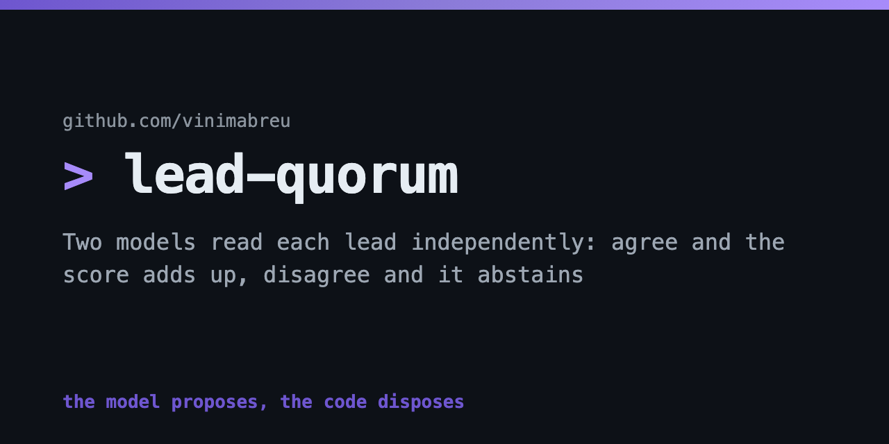
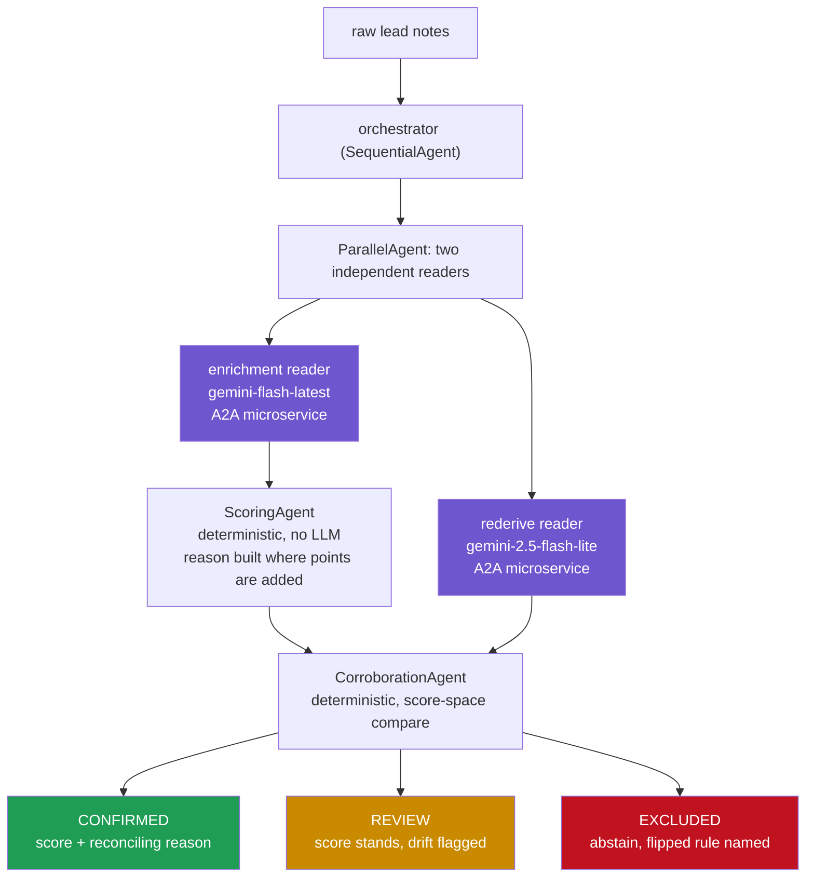
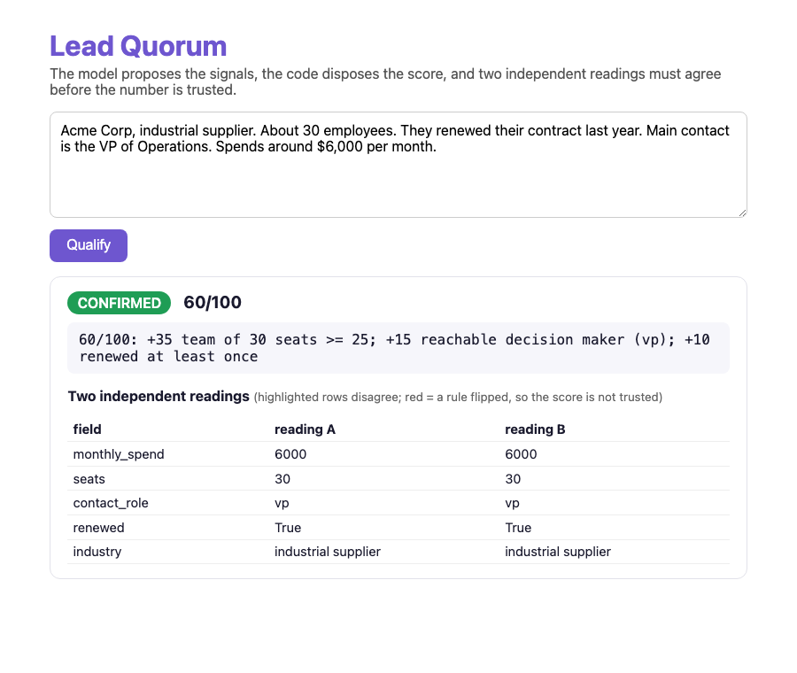
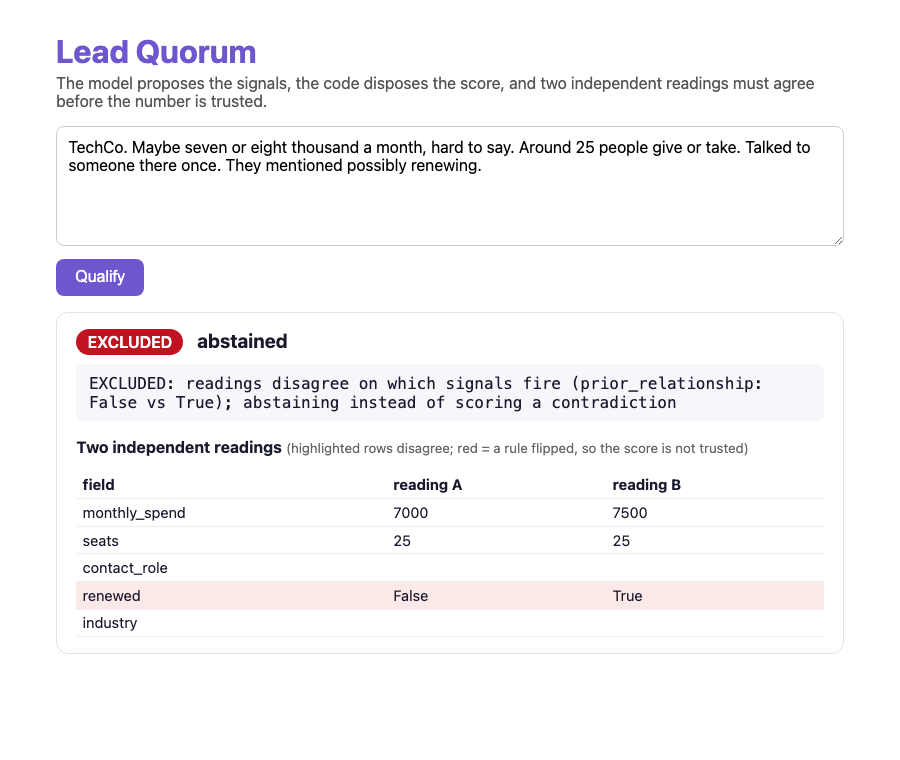

# lead-quorum

<p>


</p>

A distributed multi-agent lead qualifier built on Google's Agent Development Kit (ADK) and
the Agent2Agent (A2A) protocol. Two independent LLM readers, running **different models as
separate microservices**, extract the same lead from raw notes. Deterministic code scores
it with a reason that provably reconciles to the number. If the two readers disagree about
which scoring rules fire, the system **abstains** instead of guessing.

The model proposes, the code disposes, and no score ships unless two independent readings
agree it is real.

## Why this exists

Lead scoring is usually one big prompt: paste the lead, ask for a number. Three things
break in production:

1. **The score is opaque.** Nobody can answer "why is this a 60 and not a 40?"
2. **The explanation drifts.** The reason text is generated separately from the scoring
   logic, so when a threshold changes, the number moves and the story stays put.
3. **Confidently wrong on thin input.** A single model always returns a number, even when
   the notes do not support one.

This system attacks all three by construction.

## Architecture



- **Two readers, two models, two services.** Each reader is exposed over A2A with
  `to_a2a()` and consumed with `RemoteA2aAgent`, so corroboration is genuinely
  cross-model and cross-process, not one model agreeing with itself.
- **Scoring is pure code** (`core/scoring.py`). Every rule grants its points and writes
  its reason on the same branch, so the explanation cannot drift from the number. A test
  parses the reason and asserts the named points sum to the score.
- **Corroboration is compared in score-space** (`core/corroboration.py`). Value noise on
  the same side of every threshold is drift (verdict REVIEW, score stands, flagged).
  A disagreement that flips a rule would change the score itself, so the verdict is
  EXCLUDED and the system abstains, naming the rule that flipped and both readings.
- **Exactly two LLM calls per lead**, both in parallel, temperature 0. Everything else is
  deterministic Python. Multi-agent done naively is slower and pricier than one prompt;
  this is engineered to be cheaper per unit of trust.

## What a run looks like

Clear notes, both models agree:

```
CONFIRMED  60/100: +35 team of 30 seats >= 25; +15 reachable decision maker (vp);
           +10 renewed at least once
```

Ambiguous notes ("they mentioned possibly renewing"), the models read it differently:

```
EXCLUDED   readings disagree on which signals fire (prior_relationship: False vs True);
           abstaining instead of scoring a contradiction
```

That second answer is the point. One reader took "possibly renewing" as a renewal, the
other did not, the score would differ, so no number is shown. A defensible abstention
beats a fake-precise score built on a contradiction.

Both, live in the web UI (the whole audit trail on screen, not just a number):

<p align="center">
  
  
</p>

## Run it

```bash
uv venv --python 3.12 .venv
uv pip install -r requirements.txt
cp .env.example .env   # add your free Gemini API key (aistudio.google.com/apikey)

# single-process pipeline + web UI
.venv/bin/uvicorn web.app:app --port 8000

# the distributed proof: two A2A services + remote orchestrator, local
.venv/bin/python scripts/demo_distributed.py

# tests (deterministic core needs no key; one live test uses it if present)
.venv/bin/python -m pytest tests/ -q
```

The web UI shows the verdict badge, the score with its reconciling reason, and the two
readings side by side with disagreements highlighted.

## Ota

This repository includes an [`ota.yaml`](./ota.yaml) contract for deterministic verification, the
local web runtime, the distributed A2A demo, and the Dockerfile-owned verification image. Install
Ota from the [official installation guide](https://ota.run/docs/install), then inspect the
contract-owned task surface before choosing a lane.

```bash
# validate the contract, inspect readiness, and list human and safe-agent commands
ota validate .
ota doctor
ota tasks --use
ota tasks --safe --use

# run deterministic verification in the native repo-local virtual environment
ota up --workflow verify

# run deterministic verification in the repository Dockerfile image
ota up --workflow verify:container

# start the local web UI and prove its health endpoint
ota up --workflow app
```

The `live` and `distributed` workflows require the external Gemini path. Inspect their effects
and inputs with `ota tasks --use` before running them.

## Deploy (Cloud Run)

One image, role picked by env var. See `DEPLOY.md` for the exact commands: two reader
services (`SERVICE=a2a`, `AGENT=enrichment|rederive`), one web/orchestrator service wired
to their agent-card URLs.

## Layout

```
core/        pure logic: scoring rubric, score-space corroboration, schemas (no ADK, no LLM)
agents/      ADK layer: LlmAgent readers, deterministic BaseAgents, pipelines, A2A server
web/         FastAPI frontend
scripts/     reproducible distributed demo
tests/       16 tests: reconciliation, abstention, agent wiring, live end to end
```

## Honest limitations

- The rubric is a demo rubric (four rules). The point is the harness around it: swap in
  your own rules and the reconciliation test and corroboration keep holding.
- Cross-model corroboration catches extraction variance and ambiguous input. Two models
  from the same family can still share blind spots; the architecture takes a third
  independent reader (any framework, any vendor, it is just another A2A service) if you
  need stronger guarantees.
- ADK's A2A support is marked experimental by Google (2.3.0); pin versions.

MIT license.
